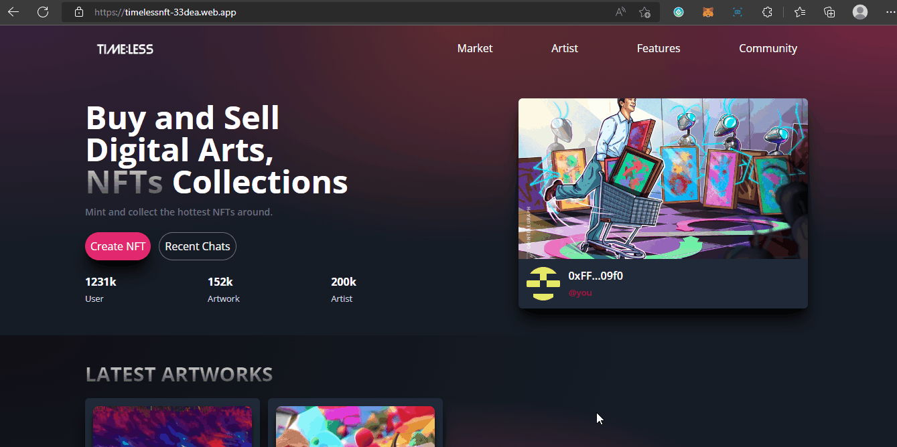

# How to Build a Better NFT Marketplace with React, Solidity

This example shows How to Build a Better NFT Marketplace with React, Solidity, and CometChat:



<center><figcaption>TimelessNFT Project</figcaption></center>

## Technology

This demo uses:

- Metamask
- Truffle
- Infuria
- ReactJs
- Tailwind CSS
- Ganache-CLI
- Solidity
- Web3js
- Faucet
- Goerli Testnet

## Running the demo

To run the demo follow these steps:

1. Clone the project with the code below.

   ```sh

   # Make sure you have the above prerequisites installed already!
   git clone https://github.com/jaid-monwr/ArtisanNFT PROVIDER_NAME
   cd PROVIDER_NAME # Navigate to the new folder.
   yarn install # Installs all the dependencies.
   ```

2. Create an Infuria project, copy and paste your key in the spaces below.
3. Update the `.env` file with the following details.
   ```sh
   ENDPOINT_URL=<PROVIDER_URL>
   SECRET_KEY=<SECRET_PHRASE>
   DEPLOYER_KEY=<YOUR_PRIVATE_KEY>
   ```
4. Run the app using `yarn start`
   <br/>

If your confuse about the installation, check out this **TUTORIAL** to see how you should run it.

## Useful links

- ⚽ [Metamask](https://metamask.io/)
- 🚀 [Remix Editor](https://remix.ethereum.org/)
- 💡 [Truffle](https://trufflesuite.com/)
- 📈 [Infuria](https://infura.io/)
- 🔥 [ReactJs](https://reactjs.org/)
- 🐻 [Solidity](https://soliditylang.org/)
- 👀 [Web3Js](https://docs.ethers.io/v5/)
- 🎅 [Faucet](https://faucets.chain.link/rinkeby)
- 🤖 [Ganache](https://trufflesuite.com/ganache/index.html)
